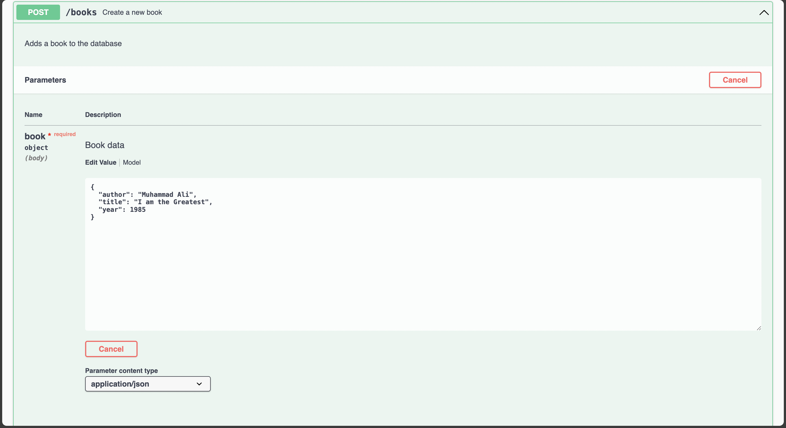
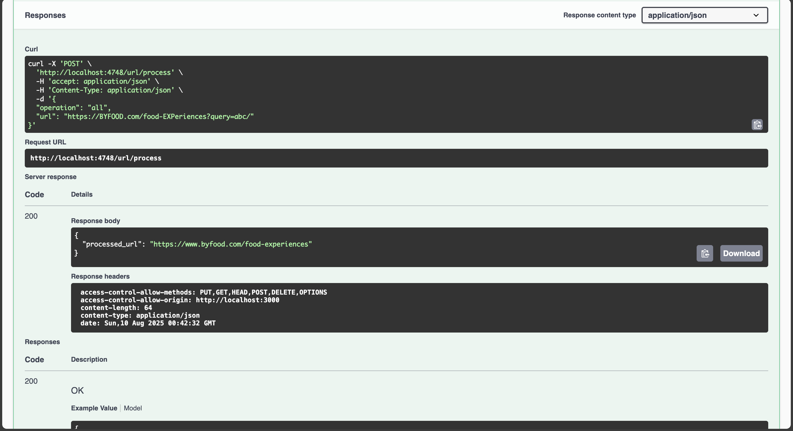
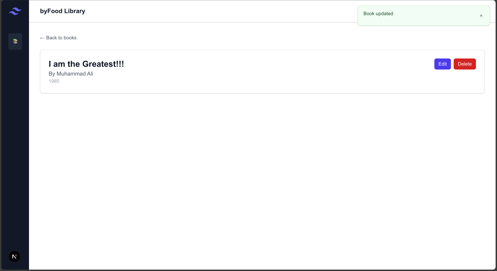
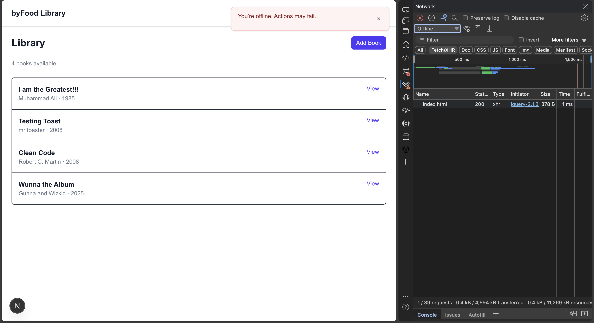

# Book Library Assessment

- **Server docs:** [`server/README.md`](./server/README.md)
- **Client docs:** [`client/README.md`](./client/README.md)

## Quick Start

### 1) Server

```bash
cd server
# Optional: spin Postgres in Docker and run API with migrations
make run/dev
# or run just the API if DB is already up
make run
```

### 2) Client

```bash
cd client
# Create `client/.env.local` with:
#API_BASE_URL=http://localhost:4748
# (ensure API_BASE_URL=http://localhost:4748)
npm install
npm run dev
```

## Screenshots

> The images below live in [`/screenshots`](./screenshots). Some have “2” variants when multiple captures were helpful.

### Backend (Swagger)








### Frontend






