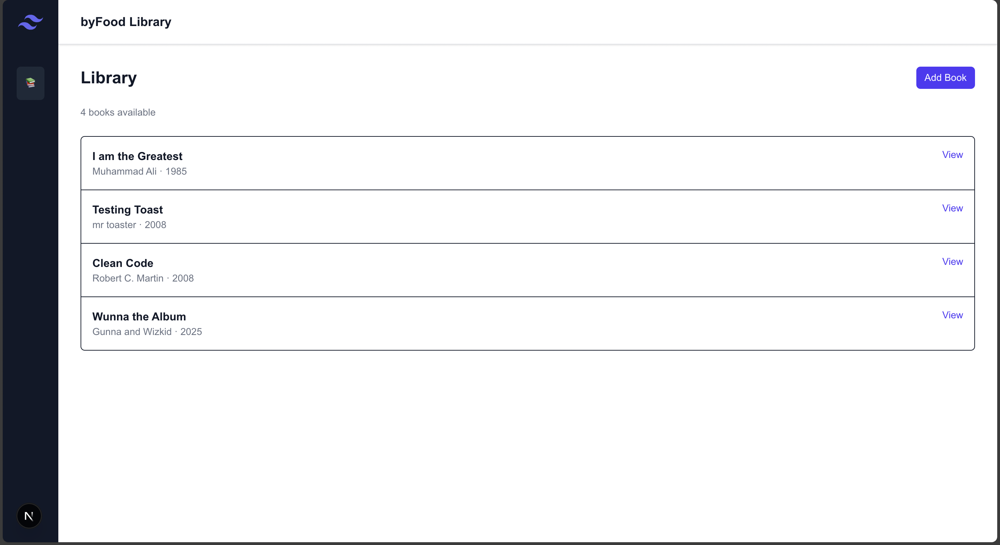
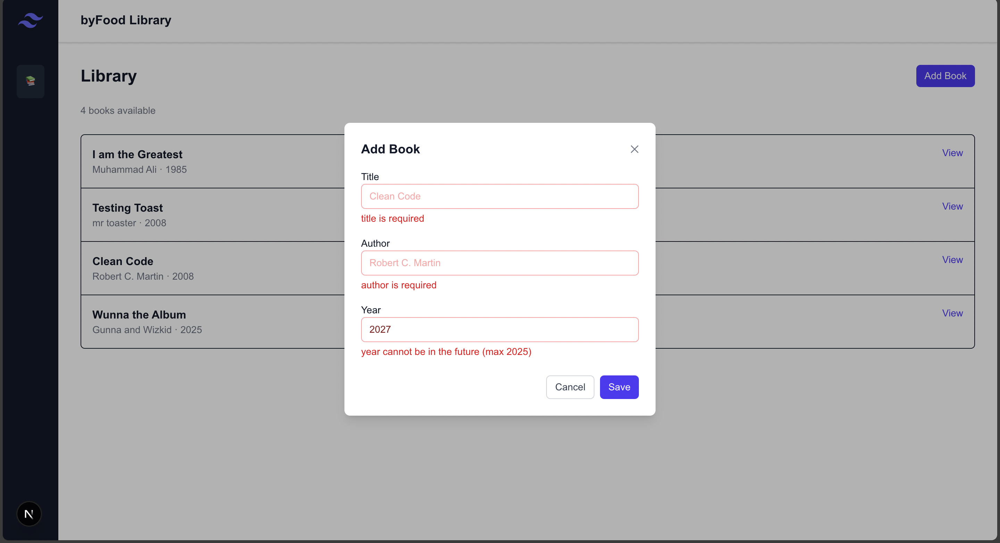
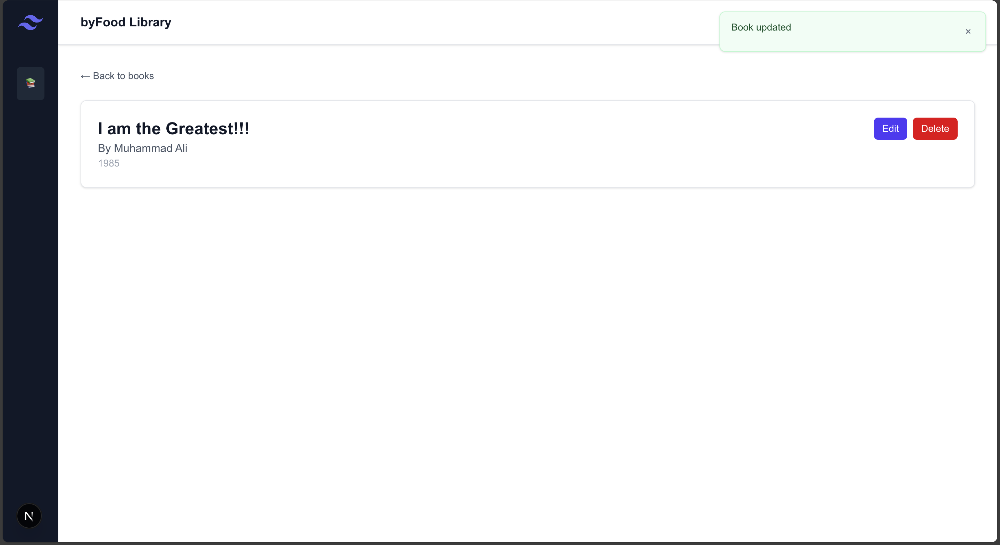
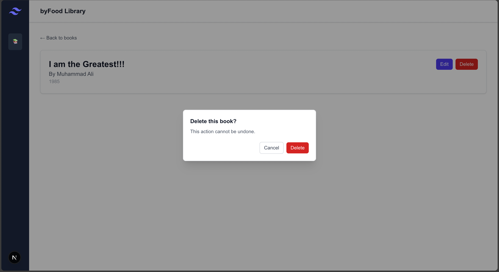
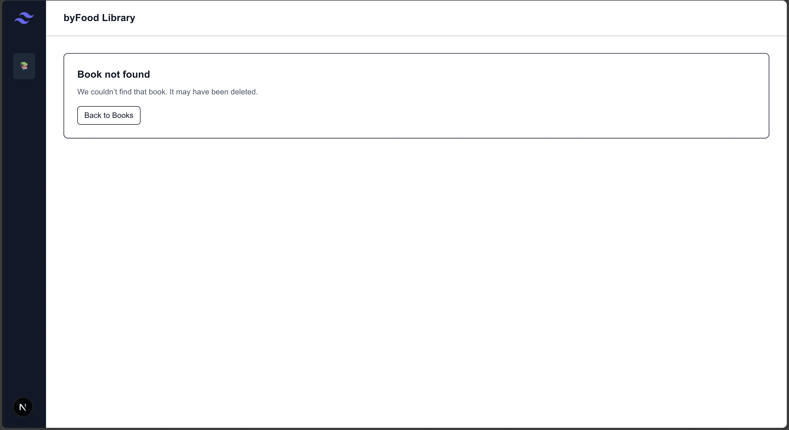
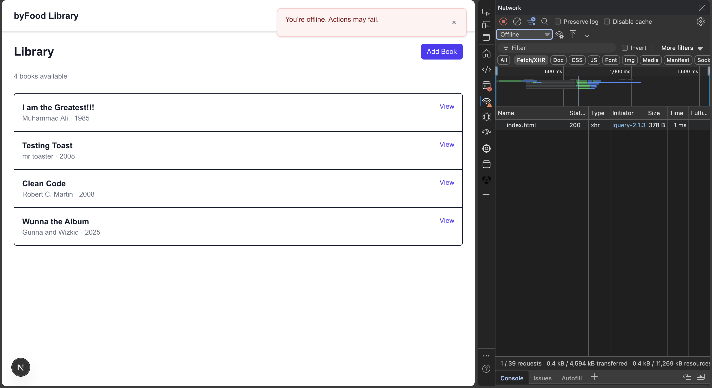

# Client (Next.js + TypeScript)

Built with **Next.js (App Router)**, **TypeScript**, and **Tailwind CSS**.  
It communicates with the Go backend via **Next.js API proxy routes** and uses a lightweight **Toast context** for friendly notifications, plus graceful loading/error states.

> The server docs, setup, and API details live in `server/`. This README focuses on the client application.

---

## ✅ Features (mapping to the brief)

- **Dashboard** listing all books with **Add, Edit, View, Delete** actions.
- **Modal dialogs** for Add/Edit with **client-side validation** and visual feedback.
- **Dynamic routing**: `app/books/[id]` for detail view.
- **Error handling**:
  - Field-level + form-level errors from the server (422, 400, etc.)
  - **NetworkWatcher**: global online/offline indicator + toasts for fetch failures.
- **State management**: React **Context** (Toast provider) shared across the app.
- **Controlled inputs** in forms with live validation messages.
- **Loading skeletons** + dedicated **error** and **not-found** pages.
- Works with backend **Swagger** docs (see `server/`).

---

## 🧰 Prerequisites

- **Node.js** 18+ (20+ recommended)
- The **Go server** running locally (see `server/README.md`)
  - Default server base URL: `http://localhost:4748`

---

## ⚙️ Setup & Run

1) **Install dependencies**
```bash
cd client
npm install
```

2) **Configure environment**
Create `client/.env.local` with:
```bash
API_BASE_URL=http://localhost:4748
```

3) **Run the app**
```bash
npm run dev
# open http://localhost:3000
```

4) **Build & start (production)**
```bash
npm run build
npm start
```

---

## 📦 Project Structure (key parts)

```
client/
└─ src/
   ├─ app/
   │  ├─ layout.tsx                 # global layout; includes ToastProvider + NetworkWatcher
   │  ├─ page.tsx                   # home (links to /books)
   │  ├─ error.tsx                  # top-level error boundary
   │  ├─ not-found.tsx              # top-level 404
   │  ├─ books/
   │  │  ├─ page.tsx                # list all books (server component)
   │  │  ├─ loading.tsx             # loading state for list
   │  │  ├─ error.tsx               # error boundary for list
   │  │  └─ [id]/
   │  │     ├─ page.tsx             # book detail (server component)
   │  │     ├─ loading.tsx          # loading state for detail
   │  │     ├─ error.tsx            # error boundary for detail
   │  │     └─ not-found.tsx        # detail 404
   │  └─ api/
   │     └─ books/
   │        ├─ route.ts             # GET (list), POST (create) proxy to server
   │        └─ [id]/
   │           └─ route.ts          # GET, PUT, DELETE proxy to server
   ├─ components/
   │  ├─ BookFormModal.tsx          # shared Add/Edit modal (controlled inputs + validation)
   │  ├─ AddButton.tsx              # opens modal, POST /api/books
   │  ├─ EditButton.tsx             # opens modal, PUT /api/books/:id
   │  ├─ DeleteButton.tsx           # confirms & DELETE /api/books/:id
   │  ├─ NetworkWatcher.tsx         # online/offline + fetch error toasts
   │  ├─ DashboardLayout.tsx        # optional layout shell
   │  └─ Skeleton.tsx               # simple loading skeleton
   ├─ context/
   │  └─ ToastContext.tsx           # global toast state + helpers (success/error)
   └─ lib/
      ├─ books.ts                   # API helpers (server-side fetch wrappers)
      └─ api-error.ts               # parseApiError: maps server errors -> UI-friendly shape
```

---

## 🔌 How the Client Talks to the Server

The client uses **Next.js API routes** to proxy requests to the Go server (so no CORS hassle):

- `GET /api/books` → proxies to `GET {API_BASE_URL}/books`
- `POST /api/books` → proxies to `POST {API_BASE_URL}/books` (`{ title, author, year }`)
- `GET /api/books/:id` → proxies to `GET {API_BASE_URL}/books/:id`
- `PUT /api/books/:id` → proxies to `PUT {API_BASE_URL}/books/:id` (partial fields allowed)
- `DELETE /api/books/:id` → proxies to `DELETE {API_BASE_URL}/books/:id`

Server validation errors (e.g., **422 with FieldErrors/Errors**) are parsed by `parseApiError` and shown inline in the modal.  
Network issues (timeouts/offline) are captured by `NetworkWatcher` and surfaced via **toasts**.

---

## 🖼️ Screenshots

> Full set is in the repo root under `./screenshots/`. A few highlights:

- **Books list**:  
  

- **Add validation (client + server)**:  
  

- **Edit / Delete**:  
    
  

- **404 & Network error**:  
    
  

---

## 🐞 Troubleshooting

- **Blank list or detail page**: ensure the server is running and `API_BASE_URL` is correct.
- **422 validation errors**: field messages appear under inputs; overall form error shows at top.
- **Network errors/offline**: a toast will appear; also see the top-right online status.
